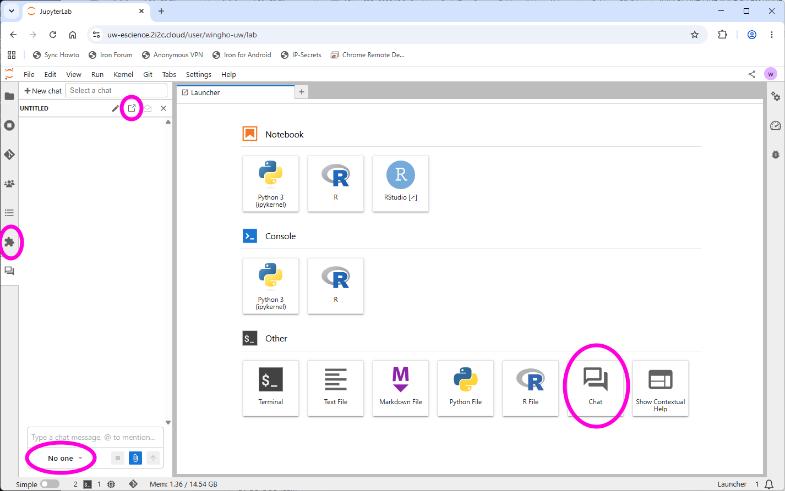
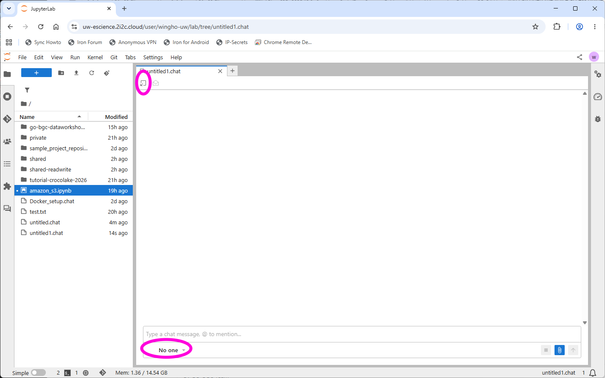

# AI Integration Guide

Cloudbank sponsors Claude Code usage for participants up to ~$20 per day during the workshop. To use the sponsored Claude Code resource, a consent form must be signed, and a key needs to be assigned to you. You should have been reached out by Anshul Tambay regarding these. Here we discuss how to set up the AI integration once these prerequisites are met.

## Jupyter-ai

Our JupyterLab is built with the `jupyter-ai` extension included. This creates a "chat" tab on the left panel, as well as a chat launcher on the launch page. The "chat" tab turns the left panel into a chat space, while the chat launcher turns the main panel into a chat space. You can switch between the two panels using "move" icon at the top of the panel.





Once you are in the chat interface, you need to select an AI provider at the bottom of the chat box. Currently the interface is integrated with GitHub Copilot (which has a free tier, but you'll using your own account's quota) and Claude Code. In the main panel setup you can also select the model being used. 

However, before you can use either provider you need to login. In both cases, the login should be one-off. As long as you've done it once you can use the service without needing to go through the login procedure again.

## Log in to GitHub Copilot

To log in to GitHub Copilot, start a Terminal and execute `copilot -i /login`. Since JupyterHub cannot launch a sub-browser, you'll need to use device code to sign in. You will then be provided with a link to log in to GitHub and an interface to enter the device code. Once the device code is entered you should be able to use GitHub Copilot in the Jupyter-ai.

## Log in to Claude Code

To use Cloudbank sponsored Claude Code you will need to use a custom entry point. To make things easier, a python script called `setup-claude-cloudbank.py` has been created in the `shared/bin` directory, courtesy Scott Handerson of UW eScience. To run the script, start the Terminal and run:

```bash
python /home/jovyan/shared/bin/setup-claude-cloudbank.py
```

On first run the script will ask you for the key you obtained. Which you can paste (you'll not see characters being entered, but pasting does work). Once a valid key is entered, the script will feed back the key information to you, and you can start using Claude Code in Jupyter-ai.