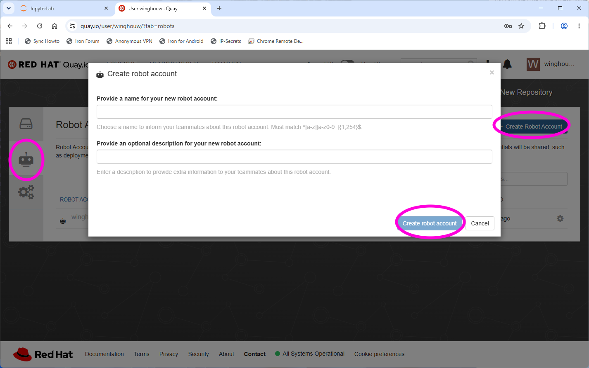
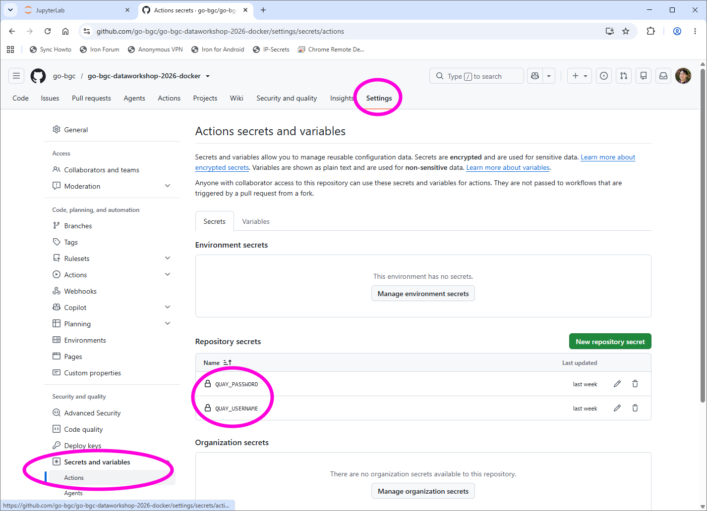
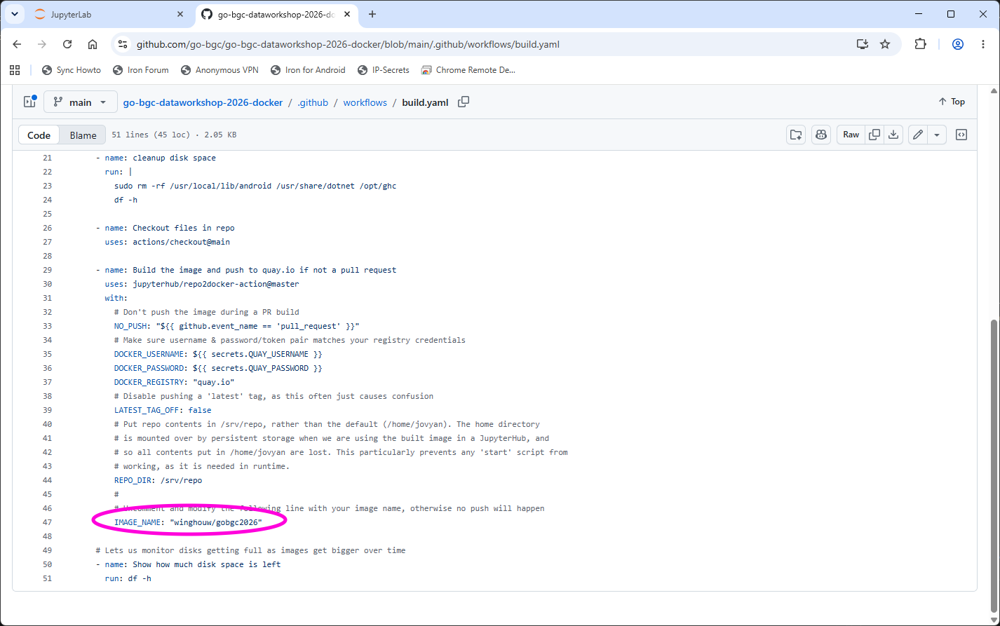
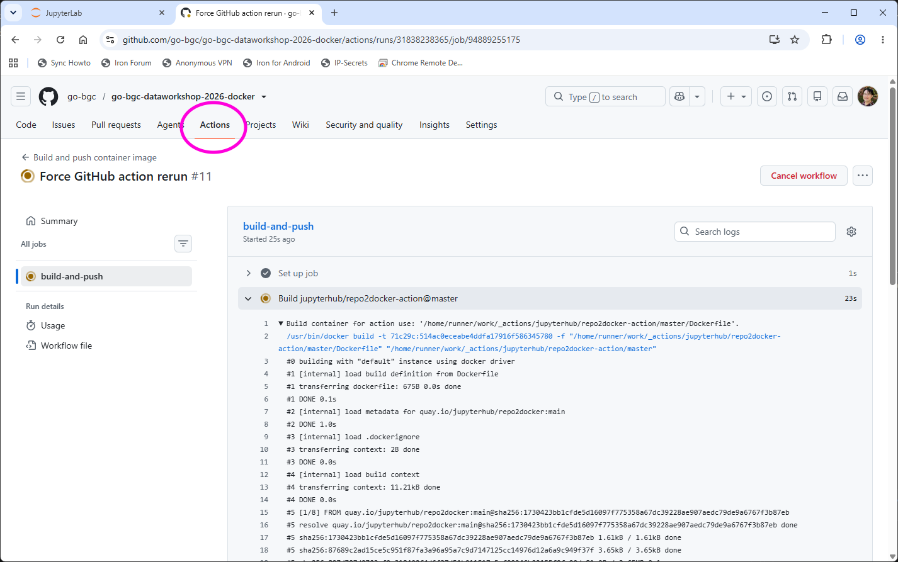
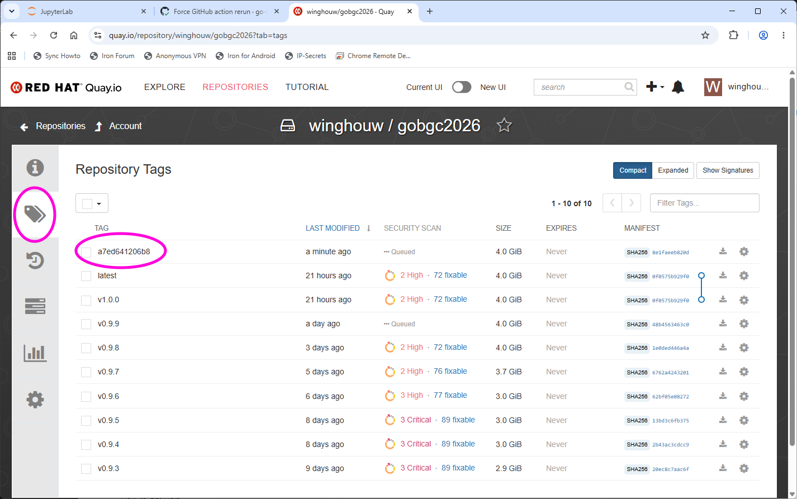
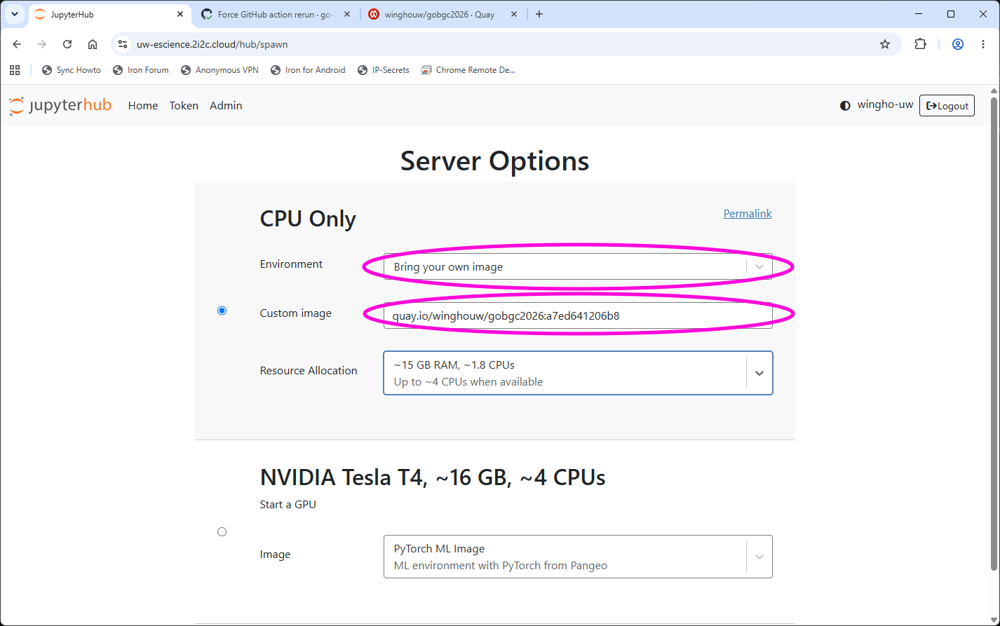

# Packages and Docker Image Guide

## Temporarily install a package

On our JupyterHub environment both the `mamba` and `pip` package managers are installed. Thus, new packages can be installed using the usual commands:

+ `mamba install <pkg>`: install the package `<pkg>` and its dependency using the `mamba` package manager.
+ `pip install <pkg>`: install the package `<pkg>` and its dependency using the `pip` package manager.

Note that the above commands can also be used to install specific version of packages. The syntax is:

+ `mamba install <pkg>=<version>`: install the package `<pkg>` of specific version `<version>` using `mamba`
+ `pip install <pkg>==<version>`: install the package `<pkg>` of specific version `<version>` using `pip`

In general, we recommend you to install using mamba whenever possible since it has better dependency management.

Importantly, because of the way JupyterHub works, the installed package will persist only **until the server shutdown**. So while the above mechanism can be useful for testing out package configurations, it may not be ideal for sustained (e.g., project) work.

## Permanently change the suite of packages using Docker

To permanently change the suite of packages available on the server, you'll need to create a custom Docker image. Luckily, you *do not* need to have Docker locally installed to do so, since GitHub can provide the image building service (an "action" in GitHub lingo).

A good place to start is to fork the [go-bgc-dataworkshop-2026-docker](https://github.com/go-bgc/go-bgc-dataworkshop-2026-docker) GitHub repo, which has the GitHub action built-in (forking creates a new remote repo that start out with the same content as the source repo. The button to fork a repo is on the top right of the repo page).

The go-bgc-dataworkshop-2026-docker repo contains a number of files. For customizing python packages, all you need to change are the `conda-packages.txt` and the `pip-packages.txt` files, the former of which corresponds to `mamba install` and is run first, the second of which corresponds to `pip install` and is run last. As with the command line variants, it is possible to version pin in these files.

In addition, for the GitHub action to successfully run, the built Docker image needs to be hosted on a image registry. A popular choice is [quay.io](https://quay.io). If you do not have a quay&#46;io account, visit the page and click the "SIGN IN" button on the top right. You'll be directed to create a new red hat account, after which you can use quay&#46;io for free for public images.

Once you log in to quay&#46;io, you will want to create a new repository for the Docker image you are going to build. Once the repository is created and make public, you'll need to create a robot account (in the "legacy" interface this is the robot icon on the left), and assign it the write permission to the new Docker repo (the same robot account can be used to write multiple repos). Make sure you copy the robot account name and password, which you'll need to enter to the GitHub repo.

Back in the GitHub repo, click on the `Settings` tab of the repo, and select `Secrets and Variables >> Actions`. There, create two variables, named `QUAY_USERNAME` and `QUAY_PASSWORD`, and enter the credential you previously copied down.

The final change you need to make is to the `build.yaml` file under the `.github/workflow` subpath. When you open the file, you will see an entry called `IMAGE_NAME`, and you need to change it to the name of the quay&#46;io Docker repo you created.

Once all these changes are made, whenever you push the new commit to the repo, GitHub action should start building your image, and you can check its progress by selection the "Actions" tab from the repo.

When the build succeed, navigate back to quay&#46;io and inspect the Docker repo. Select the "tag" tab and mark the tag of the image.

Now go back to the eScience JupyterHub [spawn page](https://uw-escience.2i2c.cloud/hub/spawn) (you may need to shutdown the current server to get to that page). Select "Bring your own image" for environment and input the Docker image path to the "Custom image" input box (the image path takes the form `<registry>/<user>/<repo>:<tag>`, e.g., `quay.io/winghouw/gobgc2026:a7ed641206b8`), and start the server. Your custom environment should then be ready!

