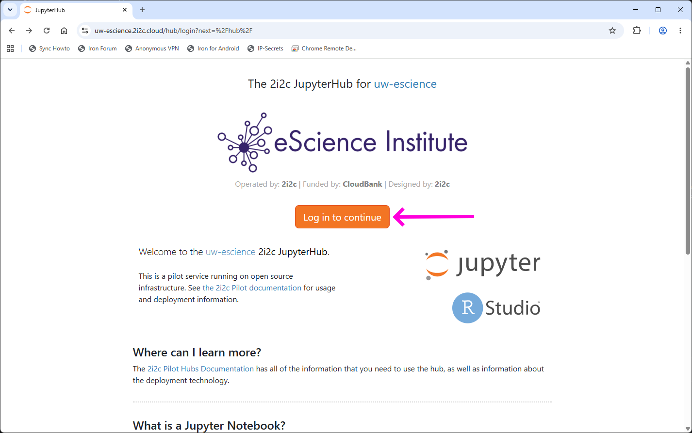
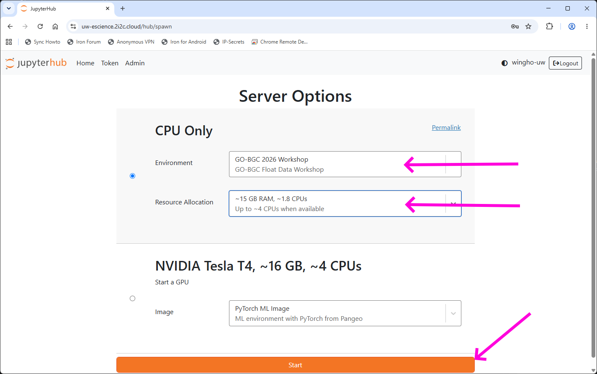
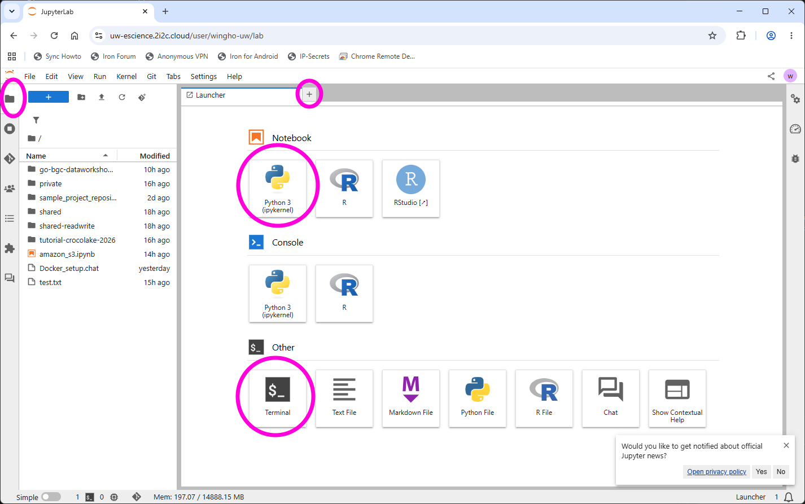
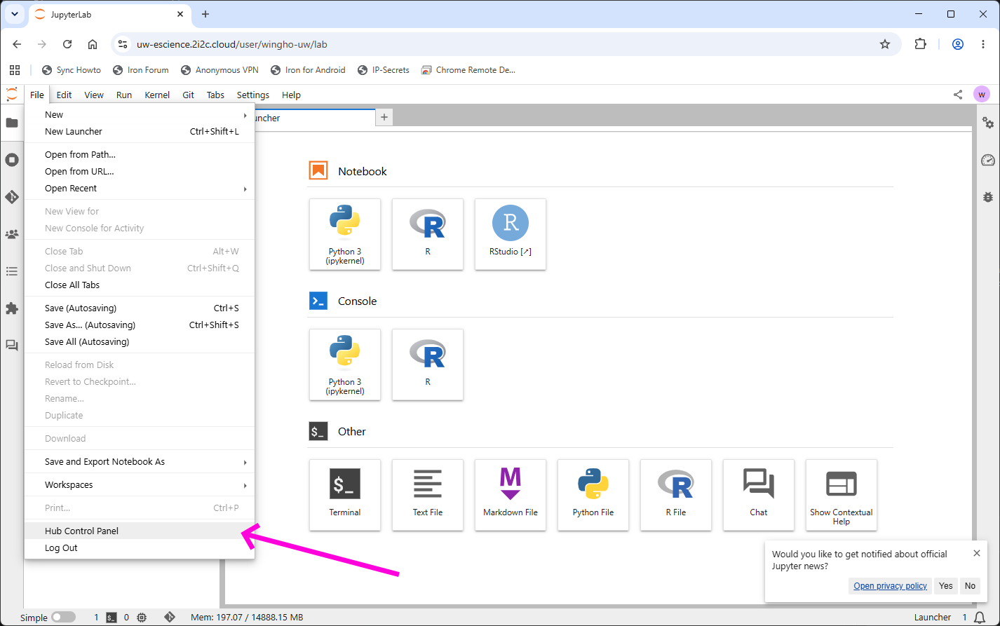
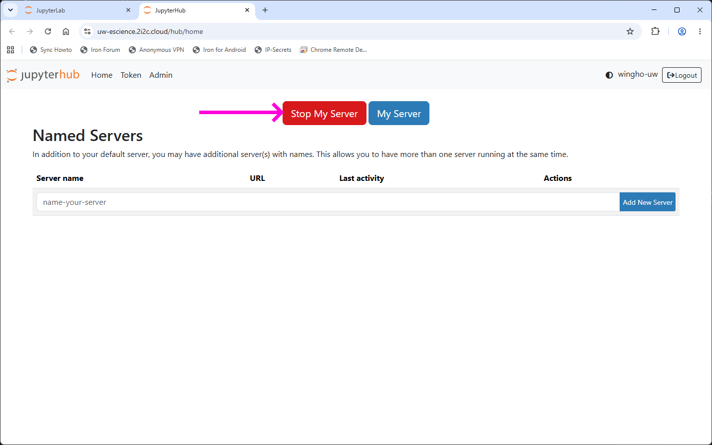

# UW eScience JupyterHub Guide

To access the UW eScience JupyterHub, navigate to [https://uw-escience.2i2c.cloud/](https://uw-escience.2i2c.cloud/).

The first time you do so, you will be redirected to a login page. From that page, click "Log in to continue" and supply your GitHub credential (the one you supplied to this workshop).

Once you login, you will be greeted with a server spawning page. A JupyterHub environment has been created for this workshop, which should be the top option under the environment tab ("GO-BGC 2026 Workshop"). In addition, you should also select the suitable resource tier for the server. The base tier ("~7 GB RAM, ~0.9 CPUs") is usable for light data science work, but we recommend using the "~15 GB RAM, ~1.8 CPU" option as default.

For your convenience, you can also use [this permealink](https://uw-escience.2i2c.cloud/hub/login?next=/hub/spawn%23fancy-forms-config=%7B%22profile%22%3A%22cpu-only%22%2C%22resource_allocation%22%3A%22mem_15_gb%22%2C%22resource_allocation%3Aunlisted_choice%22%3A%22%22%7D) to quickly select this setup.

Once you select your options, click "Start" to start the server, which can take a while for the first time.

After the server is spawned, you will be brought to a JupyterLab interface. From this interface, you can open existing files using the folder panel on the left, or bring up the launcher (if not already on) using the `+` button in the main panel. The two options from the launcher you will most likely use are Python 3 notebook (top left) and Terminal (bottom left). But also note what other options (e.g., RStudio) are available.

For more on the Python 3 notebook and Terminal environment, see the [JupyterLab guide](./JupyterLab_guide.md)

If for any reason you need to shutdown the current server and spawn a new one, use the top menu, navigate to `File >> Hub Control Panel`, which will bring up a Hub Control Panel page, from which you can stop the current server by clicking "Stop My Server".

