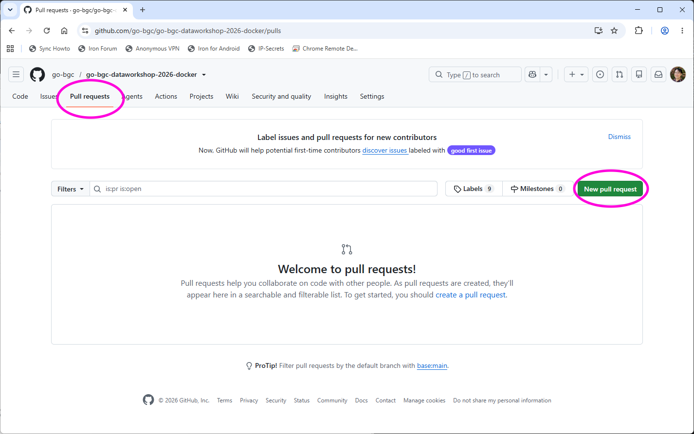

# Git and GitHub Guide

Git is a version control software. Watched contents are organized as "repos" (short for repositories), and a repo is essentially a folder with a special (and hidden) `.git` directory. Git *could* be used purely locally, but a repo usually has a remote (cloud) copy also. GitHub is a popular platform for storing such remote copies.

## Conceptual introduction to git

Local files on a Git repo can be in one of 3 states: untracked (no version control), staged (changes are tracked but not permanently recorded), and committed (changes are recorded). When a file is modified (including new file creation and existing file deletion), the changes are initially untracked. To track those changes, a `git add` command needs to be issued on those files. And to permanently record the changes, a `git commit` command needs to be issued, which make a snapshot of all the currently tracked files in the repo.

To create the local repo from a remote repo, use `git clone`. To sync any updates on the remote repo to the local repo, use `git pull`. To sync any committed updates on the local repo to the remote repo, use `git push`. 

## Walkthrough of key git commands

The commands below are available in the Terminal interface. In general, the repo being operated on is the repo that contains the current working directory.

+ `git status`: Show the current status of the local repo. Importantly, this will list the files that are untracked and staged.

+ `git add <pathspec>`: Add the files specified by `<pathspec>` to the collection of staged files. Usually `<pathspec>` is either the relative path of a specific file/folder (relative to the top of the Git repo), or a single dot (`.`), the latter of which adds all untracked files to the collection of staged files.

+ `git commit -m <message>`: Commit all the changed staged files to permanent record. The message is used to summarize the major changes between the previous snapshot and the new snapshot, and is usually entered in double quotes.

+ `git push <dest>`: Push the current snapshot to the remote repo. Most commonly `<dest>` is `origin` (no quotes), which is the location of where the repo is cloned from.

+ `git pull <source>`: Pull the current snapshot stored in the remote repo. Most commonly `<source>` is `origin`.

+ `git clone <repository>`: Clone the remote repo `<repository>` to the local filesystem. To get the correct url of `<repository>` on GitHub, navigate to the repo, click on the "Code <>" button, and use the copy icon to copy the https url to the repo.

Note that pushing to a GitHub repo generally requires login to GitHub. Similarly, pushing, pulling, and cloning a private repo on GitHub requires authentication. Since GitHub has banned plain password authentication and since JupyterHub cannot launch sub-browsers, you should set up personal access token (PAT) for authentication, as layout in the [Git setup guide](../preliminary/git.md)

## Advanced usage: branching and merge

For projects with a single developer, the above commands and usage pattern is often sufficient. However, when a project has multiple members, it is important to avoid conflicts between the work of different members, or at least to resolve them in an orderly manner. The main tool to do so in Git is **branches**. Essentially, each branch of a repo is a distinct chain of records that do not interfere with each other. Each branch can thus be used to develop specific set of features for the project, and when the set of features is ready, it can be merged back to the main branch.

The main commands associated with branching are:

+ `git branch <branch_name>`: Create a new branch called `<branch_name>`.
+ `git checkout <branch_name>`: Switch to the branch `<branch_name>`. 
+ `git merge <branch_name>`: Merge the current branch to the branch `<branch_name>`. Usually `<branch_name>` is `main`.

Note that when `git merge` is executed sometimes the merge will fail and because of conflicts, and these conflicts have to be resolved manually by editing the conflicted files.

A common development pattern is to have a small number of members (often a single person) specializing in merge management. When the other members completed their feature development, they commit their branch to the remote GitHub repo and make a **pull request** to notify the merge specialist to merge their development branch to the main branch. In that way the merge process itself will not create extra conflicts.

For more information about git commands, the official documentations and additional resources can be found on [https://git-scm.com/](https://git-scm.com/)

## Graphical user interface for Git on JupyterLab

Our jupyterlab is built with the `jupyter-git` extension included. On the left panel of JupyterLab there is a tab with the Git logo. When your file navigator is pointing at folder outside of a Git repo, the left panel will give you the option to clone a remote repo. If your file navigator is pointing at a location inside a Git repo, the left panel will give you the option to add, commit, push, and pull files, as well as the ability to manage branches.

